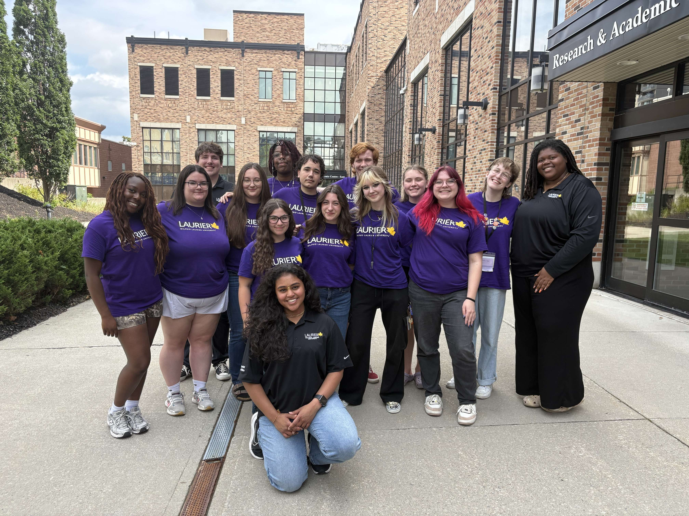

## Travel

**Since Graduation:**

- Traveled to at least 5 new countries
- Got my tattoos re-done in Exeter, England
- Cruised with my friends in a UK-based band, The White Rooms, on a Virgin Voyages cruise again

## Career

**Since Graduation:**

- Had a successful career as a Residence Life Don during undergrad at Laurier
- Stayed connected with my co-workers from the Department of Residence
- Had an impact on the students in my community

## Art

**Since Graduation:**

- Continued to express myself through makeup
- Still learning about art history and being inspired/influenced by it
- DIY mentality on my future home

## Music

**Since Graduation:**

- Continued to play guitar
- Still doing Concert photography
- Moshing in a safe way

## Educational Goals and Citations

Moeller, Theiler, and Wu's study on goal setting basically maps onto the design process we use in UX: set a goal > build a plan > gather evidence > reflect > iterate. My own post-grad goals (travel, staying connected with my Residence Life team, growing as an artist, keeping music alive) fit the "mastery goal" that the article talks about which is motivated by growth and meaning rather than some sort of external reward. Despite this similarity, they fall short of the academic model in terms of structure: I never gave them a real spec (their SMART/SMARTER criteria) or a documented action plan, and I never built in reflection checkpoints to check if I actually hit them. So I've got the authentic, personally motivated part right, but none of the iterative testing loop that the research says actually drives "measurable achievement".

Moeller, A. J., Theiler, J. M., & Wu, C. (2012). Goal setting and student achievement: A longitudinal study. *The Modern Language Journal, 96*(2), 153–169. http://www.jstor.org.libproxy.wlu.ca/stable/41684067
